# MakeyMakey TYPE-C USB Neutral (Orange & Eco-friendly)

## Introduction

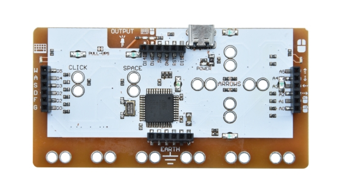 

MaKeyMaKey simulates keyboard and mouse signals. 

Theoretically, if we connect metal contacts on a conductor and the circuit board together via alligator wires, and then link them to computer, a touchpad will be formed as a computer input device.

Combined with games or media software, you can design some simple interactive media works, like fruit keyboards, which can be used to experience the fun of technology for your children!

## Parameters

| Voltage                 | Type C input 5V                     |
| ----------------------- | ----------------------------------- |
| Current                 | 500mA                               |
| Maximum power           | 2.5W                                |
| Operating temperature   | -10-50℃                             |
| Dimensions              | 94.2*49.3*10.6mm                    |
| Environmental attribute | R ROHS     □ none ROHS              |
| IDE version             | Arduino IDE 1.8.5 or later versions |
| Backup parameters       | Single board weight: 18G            |

## Mouse/Keys

MaKey MaKey is a double-sided circuit board. On the up side, 6 input buttons are reserved: up, down, left, right arrow keys as well as the space bar and left mouse key. These input holes allows us to connect them via alligator wires.

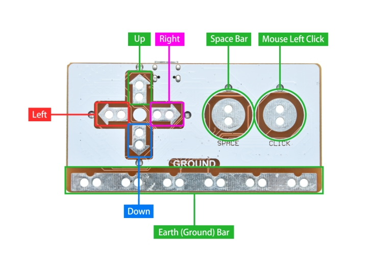 

On the other side of the board, another 12 keys are designed: W, A, S, D, F, and G on the keyboard, as well as up, down, left, right for moving and left/right for clicking on the mouse. 

There are 6 grounded(GND) outputs integrated at the bottom joints and an expansion/output interface on the top. In addition, multiple LED indicators are welded on the back to determine whether the mouse or keys are pressed.

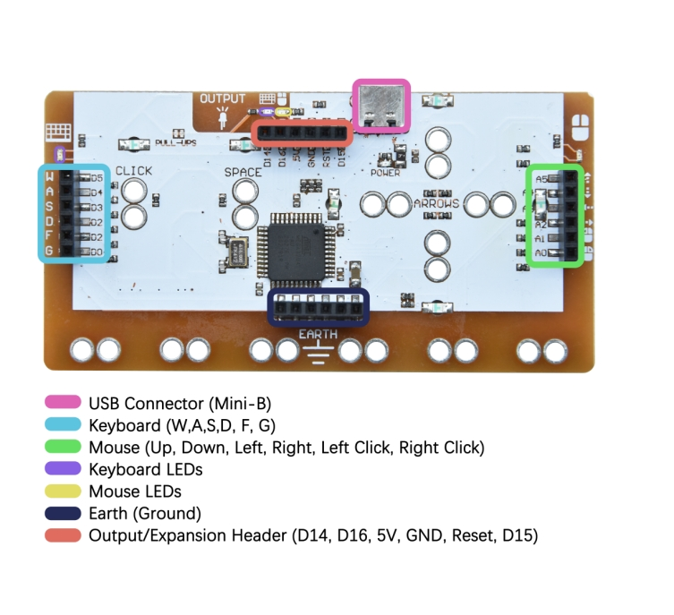 

 

## Driver Installation

### Windows

For Windows, some parts of MaKey MaKey do not require a driver. If you are bored with circuit board re-programming, please just skip this part. Only re-programming on Makey Makey requires a driver. 

We have provided a zip file , please unzip it to your computer. 

1. For the first time you connect with MaKey MaKey, Windows may warn you there is no driver installed on your computer. Therefore, we need to install a driver. 

2. Open device manager: Control Panel --> System --> Device Manager. Or run devmgmt.msc(pressing Windows+R or Start --> Run).

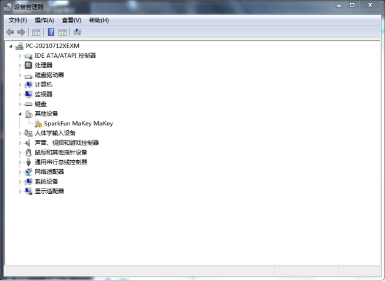

3. There is a port with an exclamation mark, just right-click to choose update driver.

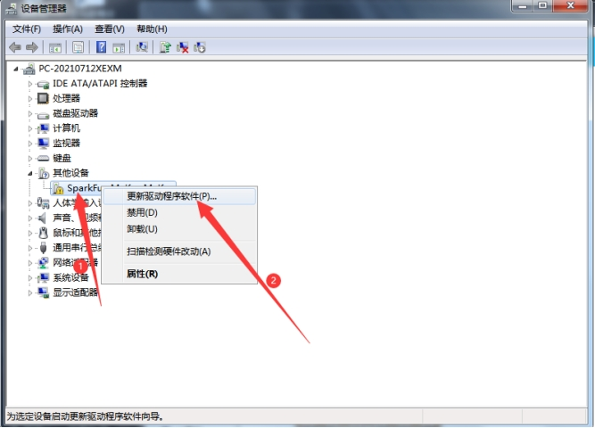 

4. We need to install the driver manually, so click Browse your computer to find driver software(R).

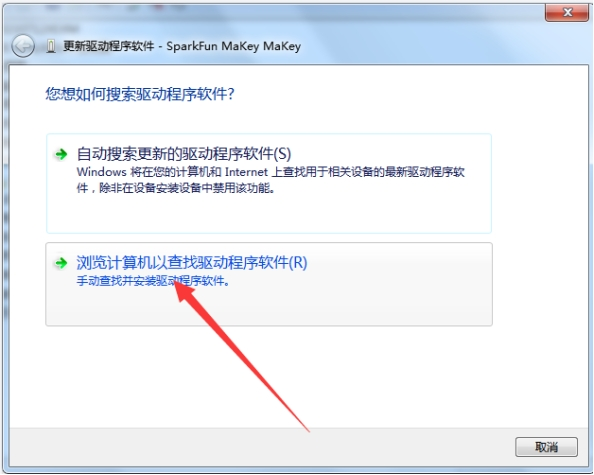 

Choose a path to save the driver: 

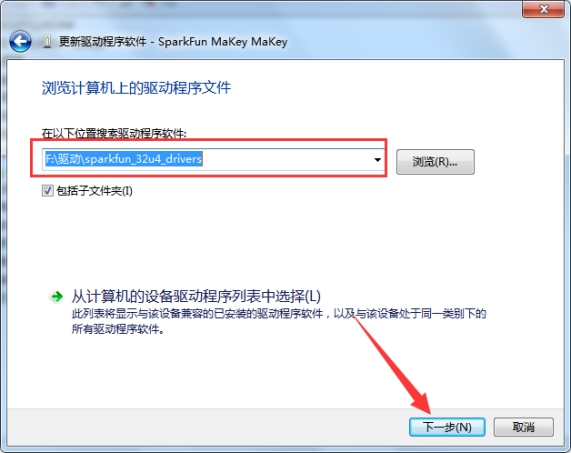 

5. You may receive a warning, please just click Install this driver software anyway.

6. Wait. And you will see a port number and a successfully installed driver: 

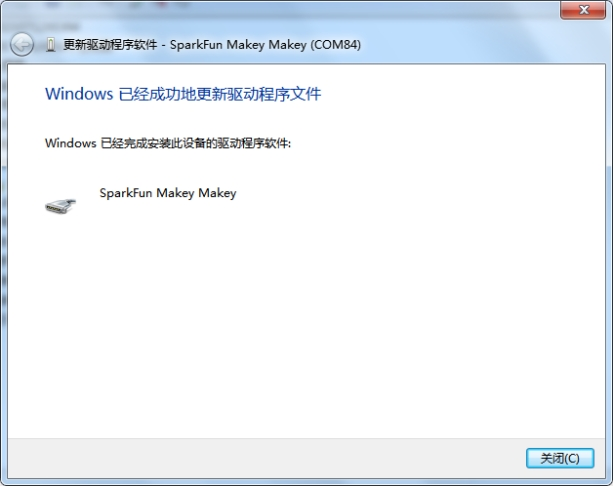 

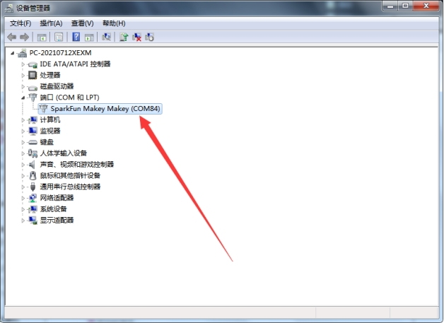 

### Mac

For Mac or Linux, there is no driver. Insert your MaKey MaKey and click Continue: 

[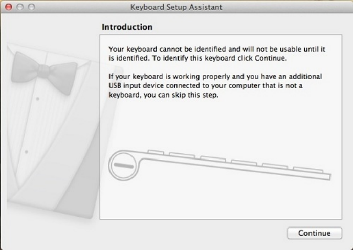](https://cdn.sparkfun.com/assets/3/5/0/c/c/52e949adce395f905f8b4568.jpg)

[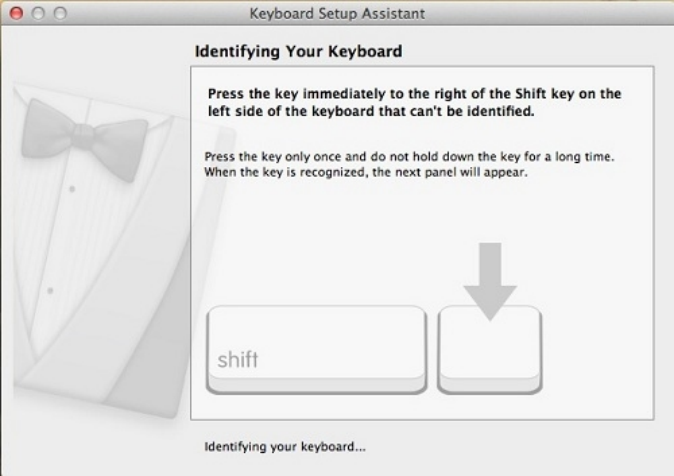](https://cdn.sparkfun.com/assets/d/6/8/1/f/52e949b2ce395f623c8b456a.jpg)

MaKey MaKey does not include a shift, let alone the key next to it. Yet you can still safely close this window. Only when you first plug in MaKey MaKey will you be asked to identify your keyboard. 

 

## Environment Configuration

1. Arduino1.8.19 IDE --> File --> Preference. 

2. Input `https://raw.githubusercontent.com/sparkfun/Arduino_Boards/master/IDE_Board_Manager/package_sparkfun_index.json` in the box and click OK.

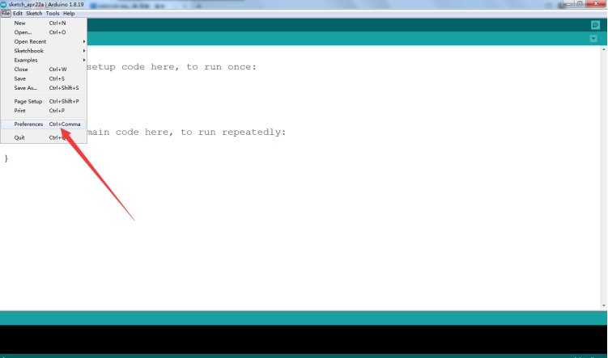 

 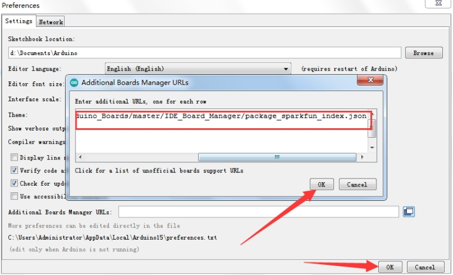 

3. Tools --> Board: --> Boards Manager: input **sparkfun** and choose the first one to install. And then you will see "sparkfun MakeyMakey" appears. Choose the corresponding board and port, and then you may burn programs to the board via USB port.

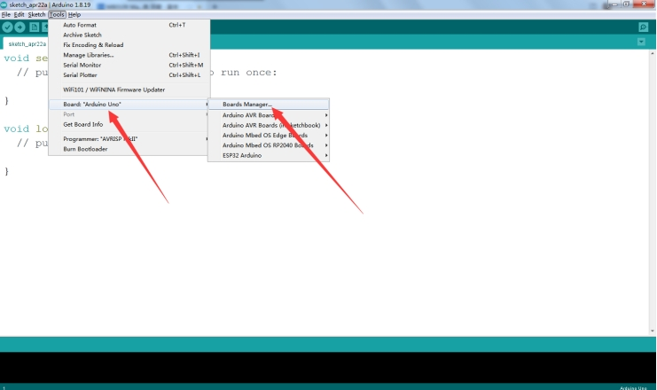 

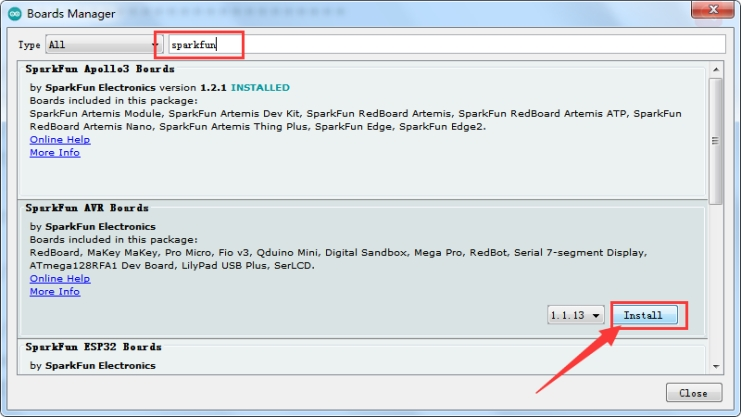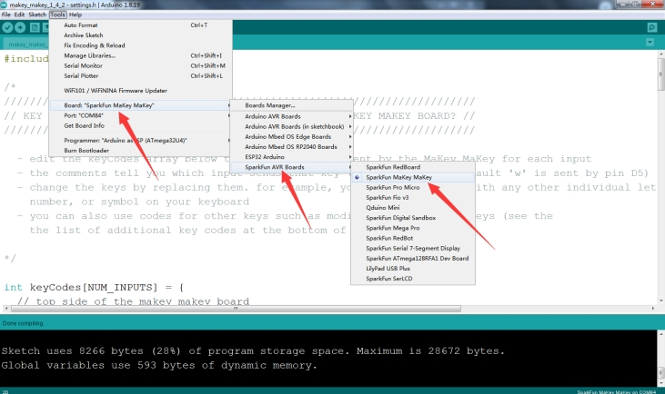 

 **Test code**: Download the [makey_makey_1_4_2](./makey_makey_1_4_2.zip) code and burn it on the board. 

##  Your First Key

You may create an artificial key that only uses your fingers. Touch the ground with one hand and the SPACE key with another, and you will see the LED above the SPACE lights up and the space command will be sent to your computer.

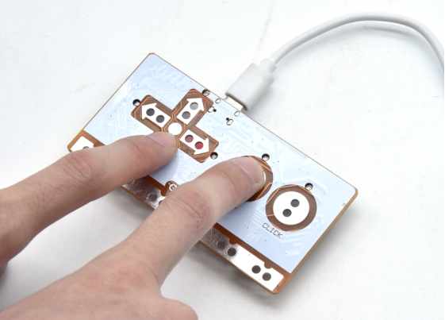

Now try placing one finger on the earth while quickly clicking the key. Feel it? It works just like a standard space key!

### Tools Needed

The followings are required: 

- MaKey MaKey input connection: by alligator wires on the top or jump wires at the bottom.
- MaKey MaKey **GND** connection: by alligator wires or jump wires to connect to ground. 
- A curtain **critical material**: This is a fun and creative part! Anything conductive can be used as the computer input, including your finger, banana and pencil.
- What **activates** the key by connecting it to the ground input: Anything slightly conductive is OK, including your fingers. 

### Key Making

Activating a key means a closed circuit. Thus, electrons must be able to flow from the MaKey MaKey input to GND. Often, your finger can be the connector. 

Let's make a MaKey MaKey key! Find a crucial conductive metrical first! 

 